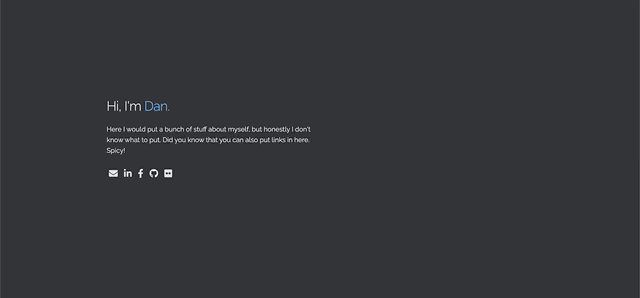

# Dan(g)

A simplistic, minimalistic, barebones (and all the other good ajectives) landing page with links to your work.


(Default options)


(With dynamic loading, rotateParagraph, and connectParagraphToHeaders enabled.)

[Live site](https://aprestoes.github.io/minimalist-landing-page)

Based off of my larger and as-of-yet incomplete [personal website](https://github.com/aprestoes/aprestoes.github.io).
Features a responsive webpage, (optionally dynamically loaded) [sliding words](https://github.com/ganlanyuan/tiny-slider), social media icons, and a dark mode.

## Config
##### index.html
Elements and sliders are loaded statically by default with the structure provided in index.html.
To use the dark mode, uncomment line 27: ```<link rel="stylesheet" href="css/darktheme.css">```
Before enabling ```loadDynamically```, remove all elements within "#rotating-words" and "#rotating-paragraphs".

##### js/main.js
```javascript
/* IMPORTANT: Each array must have at least 1 element
  and you must remove all elements within "#rotating-words"
  and "#rotating-paragraphs". REQUIRED to use other
  options.
  You can also bypass the dynamic elements entirely
  and uncomment the elements in index.html
*/
var loadDynamically = false;

/* The beginning of the header sentence has a black font.
  The headersBlack element of index i, will be added to
  the corresponding headersBlue element of index i.
  E.g. headersBlack[i] + headersBlue[i]
  headersBlack[0] + headersBlue[0]
  "Hi, I'm " + "Dan" = "Hi, I'm Dan"
  
  If one array is larger than the other, the last element
  of the smaller array will be used for the rest of the
  rotations. You can also use empty strings ""
  E.g. headersBlack[1] doesn't exist
  "Hi, I'm a student." 
*/
var headersBlack = [ //headersBlack + headersBlue, e.g. "Hi, I'm Dan"
  "Hi, I'm "
];

var headersBlue = [ //Descriptive and re-affirming words here
  "Dan.",
];

/* If true, the paragraph beneath the header will also
  rotate. If disabled, the first element of the array
  will be used for the paragraph.
  "rotating-paragraphs" div must also be of class
  "slider"
*/
var rotateParagraph = false;

/* Connects paragraph to header slider so they slide
  at the same time.
*/
var connectParagraphToHeaders = false;

/* The paragraphs to rate between. If rotateParagraph disabled,
  the first element also serves as the only paragraph.
*/
var rotatingParagraphs = [
  "Currently studying at Carleton University for computer science with a specialization in software engineering and a minor in applied linguistics. <span>Whew.</span>"
];
```

## Credits
Made with Font Awesome, Tiny Slider 2, and Skeleton.